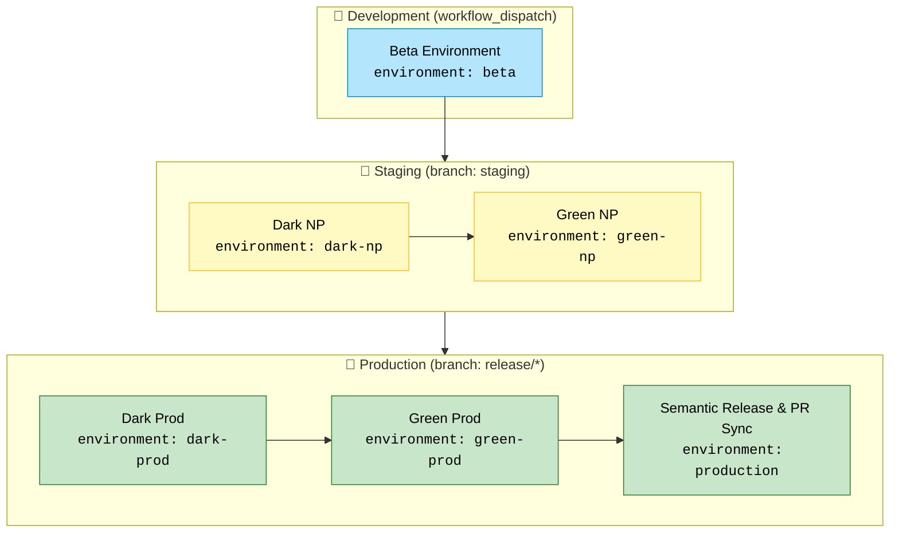

# Semantic Release

## Explicação

| Tipo de Deployment | Workflow File                       | Branch / Trigger           | Environments envolvidos            | Sequência                                              |
| ------------------ | ----------------------------------- | -------------------------- | ---------------------------------- | ------------------------------------------------------ |
| **Development**    | `.github/workflows/development.yml` | `workflow_dispatch` manual | `beta`                             | único job                                              |
| **Staging**        | `.github/workflows/staging.yml`     | `push → staging`           | `dark-np → green-np`               | dark antes de green                                    |
| **Production**     | `.github/workflows/production.yml`  | `push → release/*`         | `dark-prod → green-prod → release` | executa dark, depois green, e por fim semantic-release |
