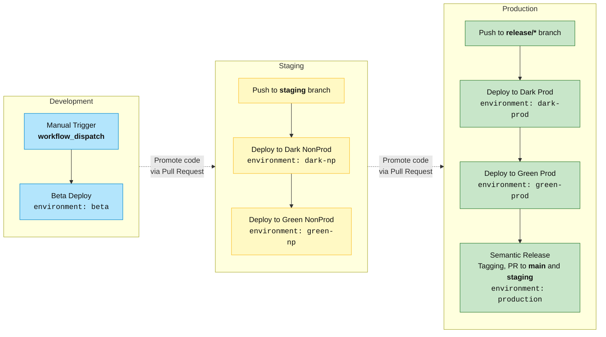

# Semantic Release

## Explain

| Deployment      | File              | Trigger                    | Environments                       | Sequence                                   |
| --------------- | ----------------- | -------------------------- | ---------------------------------- | ------------------------------------------ |
| **Development** | `development.yml` | `workflow_dispatch` manual | `beta`                             | once                                       |
| **Staging**     | `staging.yml`     | `push → staging`           | `dark-np → green-np`               | green before dark                          |
| **Production**  | `production.yml`  | `push → release/*`         | `dark-prod → green-prod → release` | runs dark, green and then semantic-release |
